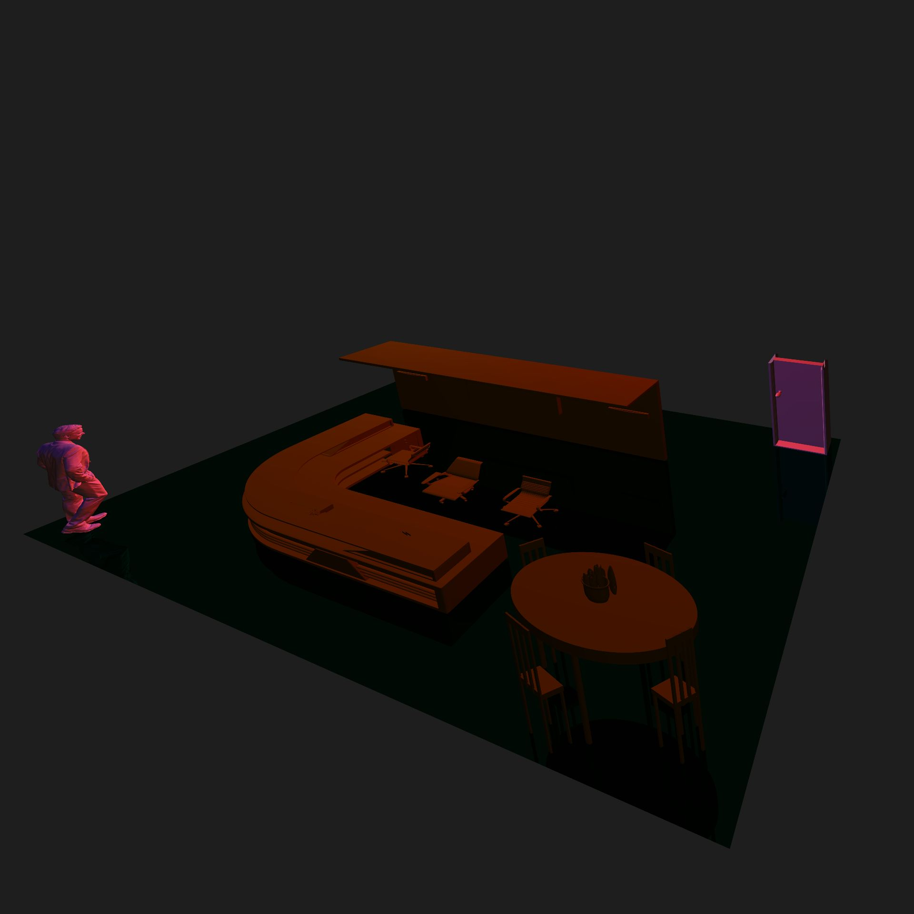
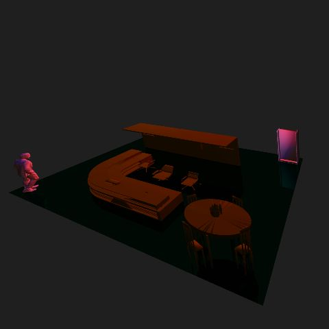
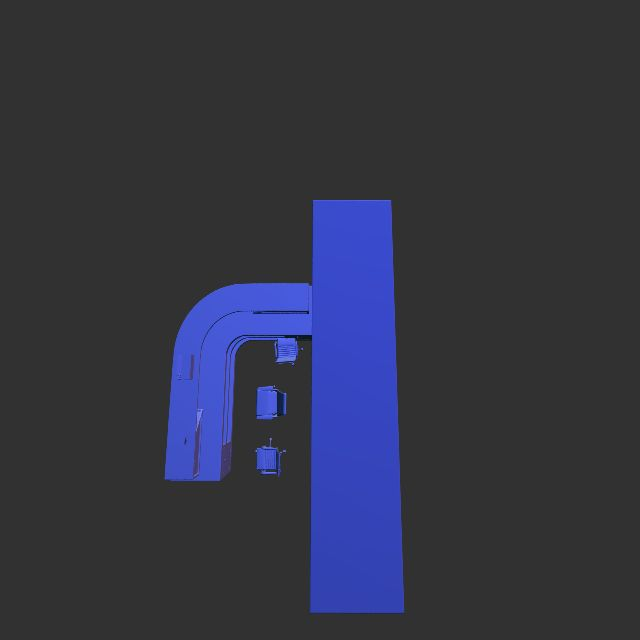

# Table of Contents
- [Concept](#1-concept)
- [Scene](#2-scene)
- [mage Features](#3-image-features)
- [Code Features](#4-code-features)
- [Acceleration](#5-acceleration)
- [Build](#6-build)
- [Acknowledgment](#7-acknowledgment)
- [Team](#8-team)
- [Comments](#9-comments)

# 1. Concept
### Habib's Reception.

We are rendering a new architecture for reception. Reception is the first area in the university encountered by any individual entering in and it is an essential part of any university. 

# 2. Scene
We attempted to make the scene of Habib University's reception area. We created the scene using Maya, generated an OBJ file and converted it to PLY file using commercially available software. We chose the scene because, in the context of Habib University, reception is one of the first places visitors get to see and is also the representation of the university's philosophy as the front face. Our scene has about 1.2 million primitives.  
  
 _High Resolution Scene (1920 x 1920)_  
  
 _Low Resolution Scene (480 x 480)_  
 

# 4. Code Features 

- Acceleration Structure
	-- KD Tree

- BRDF
	-- Glossy specular
	-- Lambertian
	-- Perfect specular

- Light
	-- Ambient light
	-- Directional light
	-- Point light
	-- Spot light

- Material
	-- Matte
	-- Phong

- Sampler
	-- Regular box
	-- Jitter gaussian

- Tracer
	-- Basic tracer
	-- Whitted

# 5. Acceleration 

# 6. Build 
Implementation associated with models/office.ply can be found [here](https://github.com/habib-university/cs440-fall19-proj-ii-the-hungry-ducks/blob/master/src/raytracer/build/buildTest.cpp)

# 7. Acknowledgment 

We have used the following third party resources for our project.
- Kevin Suffern's Ray Tracing from the Ground Up

- Nicholas Sharp's hapPLY for parsing PLY files

- Team-Raytracer github repository. 

# 8. Team 
  &nbsp; &nbsp; &nbsp; &nbsp; &nbsp; 
  &nbsp; &nbsp; &nbsp; &nbsp; 
  &nbsp; &nbsp; &nbsp; &nbsp;
 
 
**Syed M. Hasan**  &nbsp; &nbsp; &nbsp; &nbsp; **Emad Bin Abid** &nbsp; &nbsp; &nbsp; &nbsp; **Saman Gaziani** &nbsp; &nbsp; &nbsp; &nbsp; **Ismail Vohra**

# 9. Comments 
include any other comments desired by the team.

