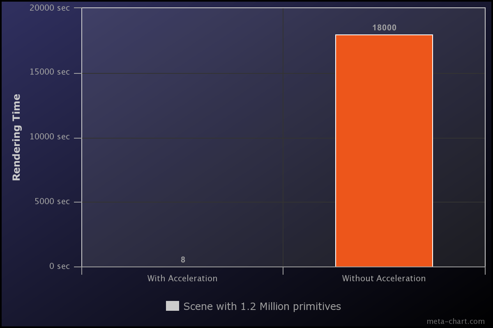

# Table of Contents
- [Concept](#1-concept)
- [Scene](#2-scene)
- [Image Features](#3-image-features)
- [Code Features](#4-code-features)
- [Acceleration](#5-acceleration)
- [Build](#6-build)
- [Acknowledgment](#7-acknowledgment)
- [Team](#8-team)
- [Bonus Features](#9-bonus-features)

# 1. Concept
### Habib's Reception.

We are rendering a new architecture for reception. Reception is the first area in the university encountered by any individual entering in and it is an essential part of any university. 

# 2. Scene
We attempted to make the scene of Habib University's reception area. We created the scene using Maya, generated an OBJ file and converted it to PLY file using commercially available software. We chose the scene because, in the context of Habib University, reception is one of the first places visitors get to see and is also the representation of the university's philosophy as the front face. Our scene has about 1.2 million primitives.  

  
 _Low Resolution Scene (480 x 480)_  

  
 _Low Resolution Scene (480 x 480)_  
 
# 3 Image Features
We also rendered a variety of the same scene using our raytracer engine.

### No Reflection
  
_High Resolution Scene Without Reflection_  

### Change of Colors
  
_High Resolution Scene With Different Colors_  

### Layout
  
_High Resolution Scene With Different Layout_  

### Anti-Aliasing
  
_High Resolution Scene With Anti-aliasing_  

# 4. Code Features 

- Acceleration Structure
	-- KD Tree

- BRDF
	-- Glossy specular
	-- Lambertian
	-- Perfect specular

- Light
	-- Ambient light
	-- Directional light
	-- Point light
	-- Spot light

- Material
	-- Matte
	-- Phong

- Sampler
	-- Regular box
	-- Jitter gaussian

- Tracer
	-- Basic tracer
	-- Whitted

# 5. Acceleration 

# 6. Build (Needs to be rechecked)
Implementation associated with models/office.ply can be found [here](https://github.com/habib-university/cs440-fall19-proj-ii-the-hungry-ducks/blob/master/src/raytracer/build/buildHabib.cpp) 
Implementation of High Resolution scene can be found [here](https://github.com/habib-university/cs440-fall19-proj-ii-the-hungry-ducks/blob/master/src/raytracer/build/buildHabibHigh.cpp)  
Implementation of Low Resolution scene can be found [here](https://github.com/habib-university/cs440-fall19-proj-ii-the-hungry-ducks/blob/master/src/raytracer/build/buildHabibLow.cpp)  
Implementation of Anti Aliasing scene can be found [here](https://github.com/habib-university/cs440-fall19-proj-ii-the-hungry-ducks/blob/master/src/raytracer/build/buildAntiAlias.cpp)  
Implementation of Chapter 14 scene can be found [here](https://github.com/habib-university/cs440-fall19-proj-ii-the-hungry-ducks/blob/master/src/raytracer/build/buildChapter14.cpp)  
Implementation of Hello World scene can be found [here](https://github.com/habib-university/cs440-fall19-proj-ii-the-hungry-ducks/blob/master/src/raytracer/build/buildHelloWorld.cpp)  
Implementation of MVP scene can be found [here](https://github.com/habib-university/cs440-fall19-proj-ii-the-hungry-ducks/blob/master/src/raytracer/build/buildMVP.cpp)  

# 7. Acknowledgment 

We have used the following third party resources for our project.
- Kevin Suffern's Ray Tracing from the Ground Up

- Nicholas Sharp's hapPLY for parsing PLY files

- Team-Raytracer github repository. 

# 8. Team 
  &nbsp; &nbsp; &nbsp; &nbsp; &nbsp; 
  &nbsp; &nbsp; &nbsp; &nbsp; 
  &nbsp; &nbsp; &nbsp; &nbsp;
 
 
**Syed M. Hasan**  &nbsp; &nbsp; &nbsp; &nbsp; **Emad Bin Abid** &nbsp; &nbsp; &nbsp; &nbsp; **Saman Gaziani** &nbsp; &nbsp; &nbsp; &nbsp; **Ismail Vohra**

# 9. Bonus Features
The following features in our project can be treated as bonus features as they go beyond the scope of project requirements. 

- **Multithreading:** Implementation of multithreading using OpenMp to boost the speed of system.  
- **Loading PLY files:** Integration of open-sourced module happly to deal with triangle mesh PLY files. 
- **Regular Sampling with Box Filter:** Implementation of regular sampling with a box filter.  
- **Jitter Sampling with Gaussian Filter:** Implemention of jitter sampling with a gaussian filter.  
- **Command-line Interface:** Implemention of a simple command line interface to run the program using multiple options/flags.  
- **Config File for Habib Layout:** Implementation of generic config file habibLayout.txt to deal with tile spaces independently. The places of objects can be changed by changing the setting in config file.  

